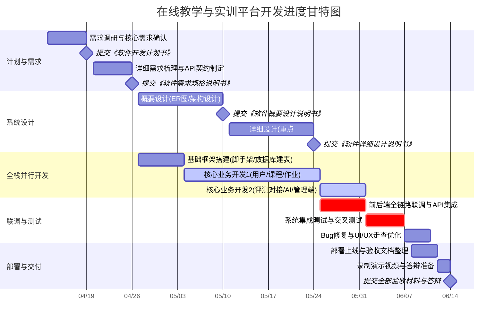

# 软件开发计划书

[TOC]

## 1 引言

### 1.1 标识

**项目名称**：在线教学与实训平台

**项目阶段**：
- 阶段一：需求调研与规划 (校历第7周)
- 阶段二：需求分析与确认 (校历第8周)
- 阶段三：核心业务模块开发 (校历第9-11周)
- 阶段四：评测系统集成 (校历第11-12周)
- 阶段五：系统测试与优化 (校历第13周)
- 阶段六：上线部署与交付 (校历第14-15周)

### 1.2 系统概述
对于目前的多数在线教学平台而言，功能大多较为固定，对AI辅助学习和知识点理解记忆的开发有所局限，以及缺乏学生自主了解和管理自身学习进度的功能。本项目通过引入智能体交互、AI辅助功能以及高性能的评测引擎，力求提供一个全面且高效的在线教学与实训解决方案。

我们小组旨在开发一个一体化的在线教学与实验平台，满足高校师生的在线教学与实训需求。实现课程管理、在线实验、自动评测、作业布置与批改、成绩统计等核心功能，结合AI辅助，打造真实且智能的教学场景，确保评测结果的准确性与系统的稳定性，并提供一些创新性的日常学习管理功能，给学生和老师带来更加契合自身学习或教学节奏的使用体验。

### 1.3 文档概述
本文档为《在线教学与实训平台》的软件开发计划书，用以规范项目开发全生命周期的里程碑进度、技术选型与软硬件资源调度。包括需求范围、实施计划、开发环境、测试与验收等。

### 1.4 与其他计划之间的关系

本计划书是整个项目的基础指导文件，与后续编写的《软件需求规格说明书》、《软件概要设计说明书》及《软件详细设计说明书》等紧密相连并具有指导作用。

## 2 参考现有平台

- 智学北航（spoc平台）：https://spoc.buaa.edu.cn/
- judge平台：https://judge.buaa.edu.cn/
- 头歌平台：https://www.educoder.net/

## 3 交付产品

### 3.1 程序
本节列出了本项目应交付的软件产品，包括要开发的和属于维护性质的部分：

- **Web端教师端应用（开发）**：
  - 用户界面：课程管理页面、实验/作业发布页面、成绩统计与分析看板等。
  - 功能需求：创建新课程（支持设置封面、编写课程简介）、配置教学计划与学习路径；布置主观/客观/编程题作业（配置测试用例、输入输出及截止时间）；在线人工或自动批改作业并写评语；支持成绩单批量导出；提供全班成绩分布直方图、及格率统计、学生任务完成进度等可视化看板。

- **Web端学生端应用（开发）**：
  - 用户界面：选课首页、最近DDL作业与通知展示、多模态课程内容播放器、在线实验区IDE（基于Monaco Editor等组件）、查询与答疑社区页面。
  - 功能需求：支持交互式选课与退课；浏览教学多模态课件，提供AI实时释义（视频播放中自动识别专业术语，点击弹出知识点闪退卡片，支持一键将笔记转化为结构化大纲并生成思维导图）；在线编写代码并提交运行（客观题自动判分，主观题拍照上传，编程题集成轻量级WebIDE，返回AC/WA/CE/RE等判题结果和解析）；拥有交互式答疑社区打破学习孤岛感。

- **系统管理员端应用（开发）**：
  - 用户界面：用户管理界面、系统监控看板、公告发布面板等。
  - 功能需求：师生生命周期管理（批量导入师生账号、重置密码、分配权限）；系统评测机负载监控（排队评测人数）、用户活跃度统计。

- **软件产品维护**：对已开发的软件产品进行定期维护和更新，包括bug修复、性能优化、功能改进等。

### 3.2 文档
本节列出了随软件产品一起交付给用户的相关文档：
- **用户手册**：包含师生操作的基本指南及操作截图。
- **部署文档**：提供系统整体部署指南。
- **技术文档**：包含《软件需求规格说明书》《软件概要设计说明书》。

### 3.3 服务
本节描述了本项目交付的服务，包括但不限于：
- **培训服务**：为系统管理员和部分教师、学生用户提供软件操作和维护培训。
- **维护服务**：提供定期的bug修复、评测机扩容支持、软件性能调优服务。

### 3.4 非移交产品
- 项目开发计划：包含开发进度及开发阶段人员分配。
- 软件测试报告与问题修改报告：测试与修复记录的过程性文件。

### 3.5 验收标准
- **软件安装**：确保系统能正确在客户端运行，数据库结构能成功初始化。
- **软件质量**：业务跑通，核心业务模块接口测试全覆盖，前端无明显UI错乱并风格友好美观。
- **软件运行和维护**：小并发量下评测系统无宕机，通过Redis缓存热点数据及采用异步消息队列削峰处理，保证系统稳定。
- **软件的安全性和保密性**：建立完善的用户密码脱敏及健全体系。

### 3.6 最后交付期限
- **阶段一：计划与需求（第7-8周）**
	- 第7周：完成需求调研与核心需求确认。第7周周日提交《软件开发计划书》。
	- 第8周：完成详细需求梳理与前后端API契约制定。第8周周日提交《软件需求规格说明书》。
- **阶段二：系统设计与基础开发（第9-12周，设计与开发交叉进行）**
	- 第9-10周：完成概要设计（ER图/架构设计），同步搭建前后端基础框架与数据库建表与核心业务全栈开发。第10周周日提交《软件概要设计说明书》。
	- 第11-12周：完成详细设计（重点为第三方API对接与异常处理），同步推进核心业务全栈开发。第12周周日提交《软件详细设计说明书》。
- **阶段三：联调与测试（第13-14周）**
	- 第13周：完成前后端全链路联调与第三方API（Judge/大模型）集成。
	- 第14周：完成系统集成测试、交叉测试与UI/UX走查优化，修复所有阻断性Bug。
- **阶段四：部署与最终验收（第15周）**
	- 第15周：完成部署上线、验收文档整理、录制演示视频与答辩准备。第15周周日提交全部验收材料（含测试报告、部署文档、用户手册、源代码和可执行代码、大模型使用说明等）。

## 4 所需工作概述

### 4.1 系统和软件的需求与约束
#### 4.1.1 需求
本项目拟建设一套面向高校教学场景的在线教学与实训平台，覆盖课程教学、作业实验、自动评测、学习过程管理、师生互动交流及智能辅助等核心业务。系统应支持教师、学生、系统管理员三类角色的差异化使用需求，并具备良好的可扩展性、可维护性和可用性。
1. **教学管理需求**
   支持教师完成课程创建、课程资料上传、教学计划配置、作业与实验发布、成绩统计分析等教学活动；支持学生完成选课、学习、提交作业、查看成绩、参与互动答疑等学习活动。
2. **在线实训需求**
   支持在线编程、实验提交、自动评测及结果反馈；能够对客观题、主观题和编程题进行分类型处理，并为编程题提供标准化的判题结果返回机制。
3. **智能辅助需求**
   引入 AI 辅助学习与教学支持能力，包括知识点解释、学习内容结构化整理、思维导图生成、问答辅助等功能，以提升学习效率和教师教学支持能力。
4. **系统管理需求**
   支持管理员完成用户管理、权限分配、系统公告发布、运行状态监控、日志查看等管理活动，保障系统平稳运行。
5. **数据与分析需求**
   支持对课程学习行为、作业完成情况、成绩分布、系统使用情况等进行统计分析，为教师教学调整和管理员系统维护提供依据。
#### 4.1.2 约束
1. **技术约束**
   * 后端采用 Java 技术体系进行开发，基于 Spring Boot 构建核心业务服务；
   * 前端采用前后端分离模式开发，基于 Vue 3 + Vite 实现教师端、学生端和管理员端界面；
   * 数据存储采用 MySQL，缓存采用 Redis；
   * 外部能力接入包括大模型 API 与第三方代码评测服务 API。
2. **运行约束**
   * 系统应部署于 Linux 云服务器环境；
   * 系统需满足实际教学场景下的小中规模并发访问需求；
   * 代码评测功能依赖外部评测服务，需考虑网络延迟、调用失败、额度限制等约束。
3. **时间约束**
   项目开发需严格按照课程大作业整体进度执行，在既定校历周期（7-14周）内完成需求分析、设计、开发、测试、部署和交付。
4. **资源约束**
   项目团队规模有限，需优先保障核心业务链路可用，在功能设计上遵循“核心优先、逐步扩展”的原则，避免范围失控。

### 4.2 项目文档编制的需求与约束
#### 4.2.1 需求
项目全生命周期中应同步形成并维护以下文档成果：
* 《软件开发计划书》
* 《软件需求规格说明书》
* 《软件概要设计说明书》
* 《软件详细设计说明书》
* 《测试报告》
* 《部署文档》
* 《用户手册》

#### 4.2.2 约束
1. 文档内容必须与系统实际实现保持一致，避免出现“文档与代码脱节”；
2. 文档应与迭代开发同步更新，在阶段性里程碑前完成相应修订；

### 4.3 系统生命周期中的位置
项目当前处于**项目立项后、需求分析与总体规划阶段**，后续将进入持续的核心模块开发、测试评估与上线维护。

### 4.4 计划策略
**计划策略**
项目采用**敏捷迭代开发方式**，结合 Scrum 的管理思想进行组织实施。以阶段性里程碑为主线，围绕教学主流程优先开发核心功能，逐步扩展辅助功能和创新功能。
1. **核心优先**：优先保障“教师建课—发布作业—学生提交—自动评测—成绩反馈”主流程完整可用；
2. **分角色并行开发**：围绕教师端、学生端、管理端和外部服务接入等方向分工协作；
3. **设计与开发交叉推进**：在保证总体设计可控的前提下，允许局部模块采用边设计边实现的方式提高效率；
4. **阶段性评审与修正**：通过每周例会交流评审、测试反馈持续修正开发计划。

### 4.5 项目进度安排
项目整体进度遵循课程要求，围绕第 7 周至第 15 周展开，主要安排如下：
* 第 7 周：需求调研、项目规划、开发计划书编制；
* 第 8 周：需求分析与需求规格说明书编制；
* 第 9—10 周：总体架构设计、数据库设计、概要设计编制与基础开发；
* 第 11—12 周：详细设计、核心模块开发与核心开发；
* 第 13—14 周：系统集成测试、问题修复与性能优化；
* 第 15 周：部署交付、文档整理、演示与答辩准备。

## 5 实施整个软件开发活动的计划

### 5.1 软件开发过程
本项目采用**敏捷开发方法**组织软件开发活动，并结合课程项目特点进行适配。项目以迭代方式推进，在保证阶段性交付要求的前提下，逐步完成需求澄清、系统设计、模块开发、集成测试和上线交付。
整个软件开发过程包括以下主要活动：
1. **需求获取与分析**
   通过需求讨论、平台参考分析和用户场景梳理，明确系统边界、功能范围和优先级，形成需求规格说明。
2. **系统与软件设计**
   完成总体架构设计、数据库设计、模块划分、接口设计及关键流程设计，形成概要设计和详细设计文档。
3. **软件实现**
   按照模块分工完成教师端、学生端、管理员端及外部服务接入等功能开发，采用版本控制与分支协作方式进行管理。
4. **联调与测试**
   在模块完成后开展前后端联调、接口测试、功能测试、集成测试和回归测试，重点验证核心业务链路、外部服务调用稳定性及系统可用性。
5. **部署与交付**
   将系统部署到目标运行环境，完成数据初始化、部署验证、文档整理和用户使用准备，形成最终交付版本。
6. **问题修复与持续改进**
   对开发、联调和测试阶段发现的问题进行跟踪、修复与验证，在迭代过程中持续优化系统性能、交互体验与文档质量。

### 5.2 软件开发总体状态
#### 5.2.1 软件开发方法
本项目采用**敏捷开发方法**，以短周期迭代推进开发工作，并通过阶段评审保证项目方向和实施质量。
- **敏捷开发方法的关键特点**：以用户故事为核心的迭代开发、持续的客户反馈闭环、以评测功能和系统可用性为核心的短周期交付。
- **支持敏捷开发的工具和过程**：
  - 项目管理与缺陷追踪：GitHub。
  - 版本控制：Git 仓库管理，采用主干分支与功能分支并行开发模式。
  - 构建与依赖管理：后端采用 Maven，前端采用 Vite 作为构建工具，包管理采用npm/pnpm；
  - 文档协作：采用腾讯文档在线文档协作平台维护项目文档。

#### 5.2.2 软件产品标准
为保证软件产品质量和文档规范性，项目开发活动需遵循统一的软件产品标准。
1. **需求与设计标准**
   * 需求应以角色、功能、流程和约束为主线进行描述；
   * 设计文档应包含系统架构、模块划分、数据库设计、接口设计及关键时序说明；
   * 对外部服务接入、异常处理、数据流转等关键内容应给出明确说明。
2. **编码标准**
   * 后端代码遵循统一命名规范、分层设计原则和异常处理规范；
   * 前端代码遵循组件化开发和页面结构统一原则；
   * 接口返回结构、错误码、日志输出格式应统一管理。
3. **测试标准**
   * 核心业务模块应进行必要的单元测试和接口测试；
   * 主流程功能必须完成联调测试与回归验证；
   * 对外部评测 API 和大模型 API 的调用需进行异常场景测试，包括超时、失败重试和结果解析错误等情况。
4. **文档标准**
   * 各阶段文档内容应真实反映开发成果；
   * 文档术语、图表编号、模块命名和版本信息保持一致；
   * 交付文档应具备可阅读、可复现和可检查的基本要求。

#### 5.2.3 可重用的软件产品
##### 5.2.3.1 吸纳可重用的软件产品
为缩短开发周期、降低实现风险，项目将优先复用成熟的软件产品和开源组件，包括但不限于：
* 在线代码编辑器组件；
* 前端 UI 组件库；
* 图表统计与可视化组件；
* 文件上传与对象存储相关工具组件；
* 第三方代码评测服务与大模型服务接口能力。
通过复用上述成熟成果，可提升开发效率，并保证系统在交互体验、功能稳定性和工程可实施性方面达到较好水平。
##### 5.2.3.2 开发可重用的软件产品
在项目开发过程中，将尽量将通用能力沉淀为可复用模块，如：
* 统一认证与权限控制模块；
* 通用接口响应封装模块；
* 缓存访问工具模块；
* 文件上传与访问模块；
* 外部 API 调用封装模块；
* AI 能力调用适配模块。
这些模块后续可在类似教学平台或校内其他信息化系统中复用。

#### 5.2.4 处理关键性请求
系统在开发和部署过程中应重点关注以下安全问题：
1. **Web 应用安全**
   防范常见 Web 安全风险，包括 SQL 注入、XSS、CSRF、越权访问、敏感接口暴露等问题。
2. **身份认证与权限控制**
   建立基于角色的访问控制机制，对教师、学生和管理员的数据权限进行严格区分，确保不同角色只能访问其授权范围内的数据与功能。
3. **外部服务调用安全**
   对第三方评测 API 和大模型 API 的访问密钥进行安全管理，采用环境变量或配置隔离方式存储，避免出现在公开代码仓库中。
4. **数据传输与访问安全**
   系统在部署时应优先采用 HTTPS 等安全通信方式，保障用户登录信息、成绩数据和作业内容在传输过程中的安全性。

#### 5.2.5 计算机硬件资源利用
系统运行对硬件资源的消耗主要集中在以下方面：
1. **Web 应用层**
   负责业务逻辑处理、页面交互支持和接口响应，对 CPU 和内存有中等需求；
2. **数据库与缓存层**
   MySQL 负责持久化存储，Redis 负责热点数据缓存与临时状态存储，对内存和磁盘 I/O 有一定要求；
3. **外部能力调用**
   编程题判题和 AI 能力调用主要依赖外部服务，因此本地服务器不承担高强度代码运行和模型推理负载，整体资源压力相对可控。
基于课程项目实际规模，采用单台云服务器部署核心业务系统、数据库及缓存服务即可满足开发、测试和演示需求；如后期访问量上升，可再考虑服务拆分与资源扩容。

## 6 实施详细软件开发活动的计划

### 6.1 项目计划和监督
#### 6.1.1 软件开发计划（包括对该计划的更新）
项目采用“两周一迭代”的敏捷模式。项目组长负责在GitHub Projects上建立看板，每周日晚召开线上/线下组会，核对当周进度与开发计划表。若发现某模块存在技术受阻，及时在周会上调整下周冲刺计划，并更新本文档的里程碑节点。

#### 6.1.2 CSCI 测试计划
本项目主要拆分为三个核心计算机软件配置项（CSCI）：Web后端业务系统、前端交互系统、外部云端评测API对接模块。测试计划着重于后端接口逻辑的单元测试，以及与第三方判题开放平台API（如Judge0/JDoodle）的连通性测试。

#### 6.1.3 系统测试计划
在第13周进行全链路系统测试，测试重心为：并发提交作业时的状态流转、大模型（LLM）接口回复的延迟与稳定性、以及调用第三方云端API时的网络超时重试处理。

#### 6.1.4 软件安装计划
系统采用传统轻量级部署方案。计划在第14周将前端打包为静态文件（dist），后端打成可执行的 .jar 包，直接部署至申请好的轻量级云服务器（如阿里云/腾讯云）运行，免去复杂的容器化环境配置。

#### 6.1.5 软件移交计划
第15周向助教和老师提交大作业交付物。移交物包括：前后端源代码、可执行代码（部署链接）、系统部署文档、用户操作手册及数据库初始化.sql脚本。

#### 6.1.6 跟踪和更新计划，包括评审管理的时间间隔
配合软工基础课的检查节点，在第8、10、12、15周作为内部关键里程碑，组内提前两天进行进度评审和文档自查，确保交付物满足课程要求。

### 6.2 建立软件开发环境
#### 6.2.1 软件工程环境
  - 后端开发：IntelliJ IDEA，JDK 1.8/11，Maven 依赖管理。
  - 前端开发：VS Code / WebStorm，Node.js，npm/pnpm。
  - 数据库与中间件：MySQL 8.0，Redis（用于缓存）。

#### 6.2.2 软件测试环境
接口测试工具：Apifox 或 Postman，用于前后端接口 Mock，以及前期独立测试第三方判题API的连通性和参数格式。

#### 6.2.3 软件开发库
代码托管采用 Gitee/GitHub 平台，建立私有仓库。采取主分支（main）、开发分支（dev）及个人特性分支（feature/xxx）的分支管理模型。

#### 6.2.4 软件开发文档
文档协作采用飞书文档或腾讯文档，定稿后导出为Markdown/PDF格式，随源代码一并纳入版本控制。

#### 6.2.5 非交付文件
组内开会的会议记录、接口草稿、大模型 Prompt 调试记录及第三方API密钥配置说明，统一存放在代码仓库的 docs/internal 目录下备查。

## 6.3 系统需求分析
### 6.3.1 用户输入分析
针对两类核心用户：
- 教师端：输入主要为课程信息、实验描述、各类题型的测试用例及标准答案。
- 学生端：输入主要为选课操作、客观题作答、在线IDE中的代码编写（支持多语言）、向AI助教提问的文本输入。

### 6.3.2 运行概念 
平台核心负载集中在作业截止前的高频代码提交阶段。为减轻我们自身服务器的计算和内存压力，系统将高耗能的代码编译与运行过程外包至云端第三方API处理。

### 6.3.3 系统需求
在第8周完成《软件需求规格说明书》，明确覆盖课程管理、在线实验、分流评测（客观题自主批改+代码题对接云端API批改）、AI知识点闪退与导图生成等核心需求。

### 6.4 系统设计
#### 6.4.1 系统设计决策
采用前后端分离架构，引入大语言模型作为AI助教支撑。在核心的评测逻辑设计上，实行**基于BaaS（后端即服务）思想的分流处理决策**：
1. **客观题（选择、填空）：** 由后端团队自主编写对比评分逻辑，直接在业务系统中完成比对与给分。
2. **代码编程题（OJ）：** 舍弃高风险的底层沙盒开发与复杂的环境部署。我们选择直接注册并调用成熟的公有云代码评测开放平台（如 Judge0 API 或 JDoodle API）。我们的后端只需通过HTTP Client将学生代码、题目限制和测试用例作为JSON发送给云端API，接收并解析云端返回的最终结果，实现零运维负担的判题功能。

#### 6.4.2 系统体系结构设计
在第10周完成《概要设计说明书》，绘制系统架构图、核心业务流程图（重点包含调用第三方判题API的时序图）和数据库ER图。

### 6.5 软件需求分析
进一步拆解出各个功能模块的具体逻辑。例如，评测服务模块需要规范对接外部OJ API的数据结构，确保能够准确接收并解析第三方返回的 AC（通过）、WA（答案错误）、TLE（超时）、CE（编译错误）等状态码；大模型模块需规范Prompt模板，确保格式化输出。

### 6.6 软件设计
#### 6.6.1 CSCI级设计决策
前后端通过JSON格式交互，统一封装 Result<T> 响应体。前端集成 Monaco Editor 解决代码高亮与缩进问题。

#### 6.6.2 系统体系结构设计
设计数据库表结构（用户表、课程表、作业表、提交记录表等），使用Redis缓存高频访问的题目数据。

#### 6.6.3 CSCI详细设计
在第12周完成《详细设计说明书》，**重点设计与云端OJ API对接的HTTP请求封装层**，包括API Key的管理、网络超时重试策略，以及对回调结果的解析与数据库状态回写机制。

### 6.7 软件实现和配置项测试
#### 6.7.1 软件实现
第9-12周为集中编码阶段。小组成员按照职责分工在各自的feature分支上开发。后端集中实现客观题的批改算法及利用 RestTemplate 或 Hutool 工具类封装第三方API调用的Service服务。
#### 6.7.2 配置项测试
开发人员需进行交叉代码审查（Code Review）。后端开发需编写Controller层的单元测试，确保基本增删改查无误；利用Postman对第三方判题API进行模拟发送，确保能成功收到外网评测结果。

### 6.8 配置项集成和测试
在dev分支进行前后端联调。重点测试代码从前端IDE发出、经后端组装并跨网调用外部OJ API、最终将评测结果返回前端页面的完整链路。联调测试中的报错通过截图加请求日志的形式发至团队群，修正后重新推代码。

### 6.9 CSCI 合格性测试
由于判题核心逻辑交由第三方平台处理，此阶段的专项测试重点为**网络与异常处理测试**：
- 测试由于网络波动导致请求第三方API超时的情况，验证系统是否有良好的报错提示及重试机制。
- 准备错误语法的代码或死循环代码进行提交，验证第三方API能否正常返回编译错误（CE）或超时（TLE），且不会导致我们自己的后端系统卡死。

### 6.10 CSCI/HWCI 集成和测试
将前后端业务代码打包部署至我们申请好的云服务器硬件环境中。重点验证服务器出网带宽能否稳定调用大语言模型API以及第三方OJ API，排查防火墙或跨域限制导致的网络请求失败。

### 6.11 系统合格性测试
第13-14周由测试同学扮演“教师”与“学生”双重角色进行黑盒走查：
1. 教师建课 -> 发作业（包含选择题和编程题） -> 配置测试用例。
2. 学生选课 -> 唤起AI助教 -> 填空题作答 -> 在线写代码提交。
3. 验证客观题可瞬间出分，代码题经过外网API判定后可正常出分，全班成绩看板统计准确。
	记录所有阻断性Bug与UI/UX瑕疵，限期2天内修复并进行回归测试。

### 6.12 软件使用准备
准备用于大作业答辩展示的可执行环境（注入脱敏的真实测试数据）。编写图文并茂的《用户手册》，为AI Agent模块撰写专项Markdown说明文档（说明Prompt设计与Skill调用逻辑），以满足课程的加分项要求。

### 6.13 软件移交准备
第15周前完成所有课程要求的验收文档整理工作。清理代码中的敏感信息（**必须将第三方API Key、大模型访问密钥移除或配置为环境变量**），更新《部署文档》，将源码打包为Zip或确保仓库权限已对助教开放。

### 6.14 软件配置管理
#### 6.14.1配置标识
代码版本采用 v0.1.0 -> v0.5.0 -> v1.0.0 的演进方式。

#### 6.14.2 配置控制
严禁未经联调直接向 main 分支合并代码。

#### 6.14.3 配置审核与交付
每次向主分支合并前，由组长或核心开发验证API接口调用是否正常，最终以 v1.0.0 Tag 作为大作业验收版本。

### 6.15 软件产品评估
结合大作业“核心需求覆盖度”和“团队分工合理性”要求，小组内部对平台进行打分检查，确保每位组员负责的4个模块、5个主要功能点均已实现并可正常交互，且平均每人至少覆盖一个核心需求。

### 6.16 软件质量保证
代码风格使用IDEA内置的 SonarLint 插件进行静态规范检查。团队内部采用“互测互评”的交叉验证策略，保证业务流程不出现死胡同。

### 6.17 问题解决过程（更正活动）
#### 6.17.1 问题/变更报告
在联调和测试阶段发现的Bug，按照格式【所在页面-复现步骤-预期结果-实际结果】提交至团队协作工具中。

#### 6.17.2 更正活动系统
设定Bug优先级：P0（阻塞主流程，如前端界面白屏、API调不通）、P1（功能错误，如成绩计算错误）、P2（UI美观度调整）。修复后由提出者验证并关闭。

### 6.18 联合评审（联合技术评审和联合管理评审）
#### 6.18.1 联合技术评审
针对“大模型功能接入”和“第三方公有云OJ API调研与测试”这两个核心技术点召开讨论会，选定速度最快、免费额度最合适的API服务（如 Judge0 公共接口）。
#### 6.18.2 联合管理评审
把控大作业各个阶段的截止时间（第七、八、十、十二周），每次文档提交前由组长统筹检查文档内容是否连续、是否有 AI 生成的生硬套话，以应对答辩要求。

### 6.19 文档编制
严格遵循助教发布的格式与命名要求。保持开发过程中的《需求规格说明书》、《概要设计》、《详细设计》与实际“调用云端第三方API”的工程架构完全一致，杜绝文档与代码脱节。为大模型技术单独撰写说明文档附带Session记录。

### 6.20 其他软件开发活动
#### 6.20.1 风险管理
主要风险在于第三方公有云API的免费额度受限或网络不稳定。对策：前端增加“提交中，请稍候”的防抖处理，后端做好超时重连逻辑；备用多个账号的API Key进行负载兜底。
#### 6.20.2 软件管理指标
功能点完成率、前后端接口联调通过率、代码提交频次。
#### 6.20.3 保密性和私密性
学生账号密码存入数据库前通过加盐哈希（如BCrypt）处理，代码仓库坚决不上传明文的第三方服务密钥。
#### 6.20.4 外部协调
主动与助教沟通，说明为了保证系统可用性，采用公有云API判题服务代替极易崩溃的本地自建沙盒，是符合企业降本增效实际的工程选择。
#### 6.20.5 项目过程的改进
在每周例会后复盘团队沟通效率，确保前后端接口定义的 Swagger/Apifox 文档及时同步。
#### 6.20.6 计划中未提及的其他活动
准备期末答辩PPT，录制3-5分钟流畅清晰的系统功能演示视频。

## 7 进度表和活动网络图

### 7.1 进度表
本项目对齐课程大作业的里程碑要求，采用敏捷迭代与全栈垂直开发结合的模式。整体进度划分为以下阶段：
- **阶段一：计划与需求（第7-8周）**- 第7周：全员完成需求调研与核心需求确认，提交《软件开发计划书》。
   - 第8周：基于垂直分工，每人梳理自己负责模块的详细需求，联合制定前后端API接口契约，提交《软件需求规格说明书》。
- **阶段二：系统设计（第9-12周）**- 第9-10周：联合进行数据库ER图设计与系统架构设计，全员评审。提交《软件概要设计说明书》。
   - 第11-12周：每人针对自己负责的4个模块进行详细设计（含前后端），重点设计调用第三方Judge API与大模型API的时序与异常处理。提交《软件详细设计说明书》。
- **阶段三：全栈并行开发与联调（第9-14周，与设计阶段交错进行）**
    - 第9-12周：基础框架搭建与核心业务开发。每人全栈完成自己模块的前后端编码，优先跑通“课程-作业-评测”主链路。
   - 第13周：第三方API集成。重点完成 Judge API 的对接与异步回调处理，以及 AI 大模型模块的 Prompt 调优与接入。
- **阶段四：测试与交付（第13-15周）**
   - 第13-14周：全链路集成测试、交叉测试与UI走查。完成测试报告与部署上线。
   - 第15周：录制演示视频，准备答辩，提交所有验收文档。如有多余的时间，整理大作业加分项材料（大模型Skill/Session文档）。

### 7.2 网络活动图

## 8 项目组织和资源
### 8.1 项目组织
团队角色与模块分配表：
|负责人|核心需求领域|负责模块|
|:-:|:-:|:-:|
|**组长 (A)**|**权限与系统观测**|1. 用户认证中心（SSO/RBAC）；2. 系统监控看板（Prometheus/Grafana）；3. 超级管理员后台；4. UI组件库维护。|
|**组员 (B)**|**课程与内容管理**|1. 课程生命周期管理；2. 多模态资源存储（云存储对接）；3. 教学大纲树形编辑器；4. 公告与通知系统。|
|**组员 (C)**|**作业与评测业务**|1. 客观题题库管理；2. 考试/作业发布系统；3. 成绩自动统计与导出；4. 主观题人工批改流。|
|**组员 (D)**|**在线实训核心**|1. WebIDE交互界面；2. Judge API适配器开发；3. 实验指导书动态渲染。|
|**组员 (E)**|**AI智能辅助**|1. 知识点闪退卡片逻辑；2. 思维导图自动化生成；3. AI 助教 Skill 库管理；4. 大模型 API 接口。|

### 8.2 项目资源
- **开发工具**：IntelliJ IDEA (Backend), VS Code (Frontend), Git (Github 托管)。
- **基础设施**：阿里云/腾讯云轻量应用服务器（1台）、MySQL 8.0、Redis 6.0。
- **外部服务**：Judge API（代码评测服务）、大模型 API 支持。

## 9 培训
由于采取全栈开发，团队成员需掌握以下跨端技术栈：
1. 全栈开发流：**Vue 3 (Composition API) + Vite + Pinia** 与 Spring Boot 2.7/3.0 的数据交互（Axios + RESTful）。
2. **API集成技术**：HttpClient/OpenFeign 调用外部 Judge API，处理异步回调与状态轮询。
3. **AI辅助开发**：学习利用大模型生成 Skills 及进行 Prompt 工程。

## 10 项目估算

### 10.1 估算规模
本项目为中型教学实训平台。根据分工要求，5 人每人负责 4 个模块，共计 20 个模块；每模块至少 5 个主要功能。整体代码规模预估在 1-2 万行左右。

### 10.2 工作量估算
团队共 5 人，项目周期跨越 9 周（第 7 周至第 15 周）。考虑到课业并行，按每人每周平均投入 12-15 小时计算：
- 总可用工时 = 5人 × 9周 × 15小时 = 675 人时 ≈ **4.2 人月**（按1人月=160小时计）。
- 工时分配：需求与设计占 25%，全栈编码占 45%，联调与 API 对接占 15%，测试与文档占 15%。

### 10.3 成本估算
本项目为学生大作业，人力成本不计。由于评测核心采用调用第三方API而非自建沙盒，大幅节省了服务器成本。
- **云服务器**：1 台轻量应用服务器，约 72 元/月。
- **第三方API**：Judge API 和大模型 API ，约 20 元/月 。
- **总预算**：100 元/月以内。

### 10.4 关键计算机资源估算
- **开发环境**：个人PC。
- **生产环境**：
   - **Web应用与数据库层**：1台 2核4G 云服务器。MySQL和Spring Boot同机部署，Redis缓存热点题目数据。
   - **评测计算层**：0台。计算压力由 Judge Server 云端承担。

### 10.5 管理预留
考虑到全栈开发模式可能带来的技术熟练度风险，以及第三方API网络波动带来的联调延迟，计划在进度表中预留 1.5 周（约 110 人时） 的缓冲时间。

## 11 风险管理

| 风险类别 | 风险描述与影响 | 发生概率 | 应对策略（缓解与应急方案） |
|---|---|---|---|
| **性能瓶颈** | **高并发瘫痪风险**：考试结束前10分钟遭遇激增提交流量，超出数据库事务承受力，导致平台崩溃。 | 高 | 使用 Redis 构建限流令牌桶控制每秒入站数。作业提交和成绩评测采用解耦式设计，采用 Spring @Async 异步处理提交请求，避免阻塞线程 |
| **产品体验** | **易用性缺陷**：学生通过网页编写全量代码极不便，缺乏补全，效率差。 | 中 | 避免从底层开发。使用开源的高成熟度 Monaco Editor 等代码编辑器，还原本地 VSCode 原生体验（附带语法高亮与关键括号补全）。开展充分的前期前端选型测试。|
| **进度失控** | **因沙盒性能调优导致的进度延期**：对于小众语言的编译判定规则探索超过团队原定排期。 | 中 | 优先开发与调优受众最大的 Java/Python/C++ 判题机制。设立技术预研节点，如有难点优先考虑技术降级引入开源判题引擎辅助。动用第 10.5 节列出的时间管理预留。|

## 12 支持条件
### 12.1 计算机系统支持
- **开发环境**：团队成员自备个人PC（满足前后端开发及Docker运行需求）。
- **部署与演示环境**：团队自费租赁1台云服务器（2核4G，Linux系统），用于系统部署、联调测试与最终答辩演示。代码版本控制与托管依赖 GitHub/Gitee 平台。

### 12.2 需要需方承担的工作和提供的条件
课程组作为模拟的需方，需要：
- 明确大作业的核心需求方向与各阶段文档提交的截止时间；
- 在需求不确定时，通过课程群或答疑时间提供方向性指导；
- 按照大作业评分标准，对阶段性成果和最终交付物进行评审与打分。

### 12.3 需要承包方承担的工作和提供的条件
- **进度保障**：严格遵循校历第7-15周的里程碑节点，按时提交《软件开发计划书》等5份过程文档及最终源码；
- **质量保障**：优先保障核心业务链路（建课-布置作业-提交代码-评测出分）的可用性与稳定性，确保答辩演示时系统不出现阻断性Bug；
- **数据保障**：由团队自行编写脚本生成符合逻辑的模拟测试数据（包括课程、用户、作业及提交记录），不依赖外部提供真实数据；
- **答辩保障**：提前准备清晰的演示视频与PPT，确保能直观展示系统核心功能与加分项。

## 13 注解
- **Judge Server**：负责安全隔离并在受限环境下对学生提交代码进行编译运行检验并自动打分的底层评测子系统。
- **AC/WA/TLE/MLE/RE/CE**：对应评测结果的代码状态：Accepted（通过）、Wrong Answer（解答错误）、Time Limit Exceeded（时间超限）、Memory Limit Exceeded（内存超限）、Runtime Error（运行错误）、Compile Error（编译错误）。
- **DDL**：Deadline（截止日期）。
- **Monaco Editor**：由微软出品的网页端轻量代码编辑器核心，是 VS Code 的底层支撑模块。
