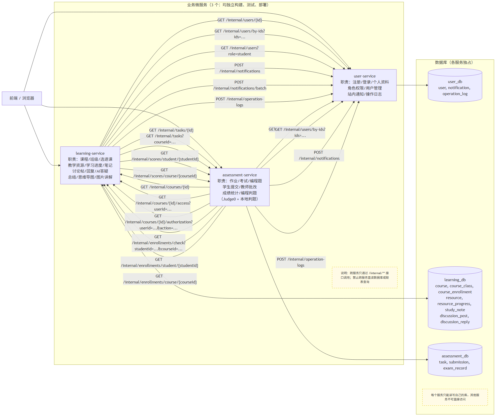

# 在线教学平台微服务拆分设计

> 目标：把单体 Spring Boot 系统拆分为 3 个可独立构建、测试、部署的业务微服务，前端、API 网关、注册中心、配置中心和数据库不计入业务服务数量。

## 1. 服务划分图



划分原则：

- 按业务域（Bounded Context）拆分，而不是按页面或用例数量机械拆分。
- 每个服务独占自己的数据表，其他服务不能直接读写这些表。
- 跨服务数据只能通过 `/internal/**` 接口或事件完成。
- 前端、Nginx、MySQL、AI API、Judge0 属于支撑组件，不算业务微服务。

## 2. 服务职责

### user-service（用户与身份域）

- 注册、登录、个人资料。
- 角色与权限。
- 用户管理。
- 站内通知。
- 操作日志统一接收与存储。

### learning-service（学习与内容域）

- 课程、班级、选课/退课。
- 教学资源、学习进度、学习笔记。
- 讨论帖、讨论回复。
- AI 答疑、总结、思维导图、图片讲解。

### assessment-service（测评与判题域）

- 作业、考试、编程题。
- 学生提交、教师批改。
- 成绩统计。
- 编程判题（Judge0 + 本地判题）。

## 3. 数据表归属

| 表名 | 归属服务 | 说明 |
|---|---|---|
| `user` | user-service | 用户唯一数据源 |
| `notification` | user-service | 其他服务只能通过接口发通知 |
| `operation_log` | user-service | 审计日志统一归口 |
| `course` | learning-service | 课程唯一数据源 |
| `course_class` | learning-service | 班级 |
| `course_enrollment` | learning-service | 选课关系 |
| `resource` | learning-service | 教学资源 |
| `resource_progress` | learning-service | 学习进度 |
| `study_note` | learning-service | 学习笔记 |
| `discussion_post` | learning-service | 讨论帖 |
| `discussion_reply` | learning-service | 讨论回复 |
| `task` | assessment-service | 作业/考试/编程题 |
| `submission` | assessment-service | 提交记录 |
| `exam_record` | assessment-service | 考试记录 |

约束：

- 每个表只有一个属主服务，其他服务不得直接读写。
- 其他服务只保存引用 ID，例如 `submission.student_id`、`task.course_id`，不保存冗余字段，也不建跨库外键。
- 需要对方数据时，必须通过接口或事件获取，禁止跨服务联表查询。

## 4. 服务接口清单

### user-service

| 方法 | 路径 | 用途 |
|---|---|---|
| GET | `/internal/users/{id}` | 按 ID 获取用户基础信息 |
| GET | `/internal/users?role=student` | 按角色获取用户列表 |
| GET | `/internal/users/by-ids?ids=1,2,3` | 批量获取用户信息 |
| GET | `/internal/users/course/{courseId}` | 获取课程关联的用户列表 |
| PATCH | `/internal/users/{id}/status` | 修改用户状态（启用/禁用） |
| POST | `/internal/notifications` | 创建站内通知 |
| GET | `/internal/notifications/user/{userId}` | 获取用户通知列表 |
| POST | `/internal/notifications/batch` | 批量创建通知 |
| POST | `/internal/notifications/{id}/read` | 标记单条通知已读 |
| POST | `/internal/notifications/read-all` | 标记全部通知已读 |
| POST | `/internal/operation-logs` | 写操作日志 |
| GET | `/internal/operation-logs/recent` | 获取最近操作日志 |
| GET | `/internal/operation-logs/user/{userId}` | 获取用户操作日志 |

### learning-service

| 方法 | 路径 | 用途 |
|---|---|---|
| GET | `/internal/courses/{id}` | 获取课程信息 |
| GET | `/internal/courses/{id}/access?userId=...` | 校验用户对课程的访问权限 |
| GET | `/internal/courses/{id}/authorization?userId=...&action=...` | 校验用户对课程的指定操作权限 |
| GET | `/internal/courses?teacherId=...` | 获取教师课程列表 |
| GET | `/internal/courses?studentId=...` | 获取学生课程列表 |
| GET | `/internal/courses/active` | 获取活跃课程列表 |
| GET | `/internal/enrollments/check?studentId=...&courseId=...` | 校验选课关系 |
| GET | `/internal/enrollments/student/{studentId}` | 获取学生选课列表 |
| GET | `/internal/enrollments/course/{courseId}` | 获取课程选课学生列表 |
| POST | `/internal/enrollments` | 创建选课记录 |
| POST | `/internal/enrollments/by-invite` | 通过邀请码选课 |
| DELETE | `/internal/enrollments/{studentId}/{courseId}` | 退课 |
| GET | `/internal/classes/course/{courseId}` | 获取课程班级列表 |
| POST | `/internal/classes` | 创建班级 |
| PUT | `/internal/classes/{classId}` | 更新班级信息 |
| DELETE | `/internal/classes/{classId}` | 删除班级 |
| DELETE | `/internal/classes/{classId}/members/{studentId}` | 移除班级成员 |

### assessment-service

| 方法 | 路径 | 用途 |
|---|---|---|
| GET | `/internal/tasks/{id}` | 获取任务信息 |
| GET | `/internal/tasks?courseId=...` | 获取课程任务列表 |
| GET | `/internal/tasks/student/{studentId}` | 获取学生任务列表 |
| POST | `/internal/tasks` | 创建任务（作业/考试/编程题） |
| PUT | `/internal/tasks/{taskId}` | 更新任务信息 |
| PATCH | `/internal/tasks/{taskId}/status` | 修改任务状态（发布/归档） |
| GET | `/internal/submissions/task/{taskId}` | 获取任务所有提交 |
| GET | `/internal/submissions/student/{studentId}` | 获取学生所有提交 |
| GET | `/internal/submissions/{submissionId}` | 获取单条提交详情 |
| POST | `/internal/submissions` | 创建提交 |
| PUT | `/internal/submissions/{submissionId}` | 更新提交内容 |
| POST | `/internal/submissions/{submissionId}/grade` | 批改提交 |
| GET | `/internal/exams/{taskId}/student/{studentId}` | 获取学生考试状态 |
| POST | `/internal/exams/{taskId}/begin` | 开始考试 |
| PUT | `/internal/exams/{taskId}/progress` | 保存考试进度 |
| POST | `/internal/exams/{taskId}/submit` | 提交考试 |
| GET | `/internal/scores/student/{studentId}` | 获取学生成绩汇总 |
| GET | `/internal/scores/student/{studentId}/course/{courseId}` | 获取学生单科成绩 |
| GET | `/internal/scores/course/{courseId}` | 获取课程成绩汇总 |
| GET | `/internal/scores/course/{courseId}/export` | 导出课程成绩 |
| POST | `/api/v2/judge/submit` | 提交代码到判题系统 |

## 5. 跨服务调用与失败处理

| 调用方 | 被调方 | 场景 | 接口 | 失败处理 |
|---|---|---|---|---|
| learning-service | user-service | 显示学生/教师姓名 | `GET /internal/users/{id}` | 超时重试；失败降级为显示 `user_id` 或缓存姓名 |
| learning-service | user-service | 批量获取学生姓名 | `GET /internal/users/by-ids?ids=...` | 超时重试；失败降级显示 ID |
| learning-service | user-service | 按角色获取用户 | `GET /internal/users?role=student` | 超时重试；失败降级为空列表 |
| learning-service | user-service | 课程通知 | `POST /internal/notifications` | 异步事件 + 重试 + 死信队列 |
| learning-service | user-service | 批量通知 | `POST /internal/notifications/batch` | 异步事件 + 重试 + 死信队列 |
| learning-service | user-service | 记录操作日志 | `POST /internal/operation-logs` | 异步上报 + 重试，失败保留记录待补偿 |
| assessment-service | user-service | 显示学生姓名、教师批改人 | `GET /internal/users/{id}` | 超时重试；失败降级显示 ID |
| assessment-service | user-service | 批量获取学生信息 | `GET /internal/users/by-ids?ids=...` | 超时重试；失败降级显示 ID |
| assessment-service | user-service | 成绩通知 | `POST /internal/notifications` | 异步事件 + 重试 |
| assessment-service | user-service | 记录操作日志 | `POST /internal/operation-logs` | 异步上报 + 重试 |
| assessment-service | learning-service | 创建任务前校验课程 | `GET /internal/courses/{id}` | 同步调用；失败直接返回错误，不写库 |
| assessment-service | learning-service | 提交前校验选课权限 | `GET /internal/courses/{id}/access` | 同步调用；失败拒绝提交 |
| assessment-service | learning-service | 校验细致操作权限 | `GET /internal/courses/{id}/authorization` | 同步调用；失败拒绝操作 |
| assessment-service | learning-service | 校验选课关系 | `GET /internal/enrollments/check` | 同步调用；失败拒绝操作 |
| assessment-service | learning-service | 批量获取学生选课列表 | `GET /internal/enrollments/student/{studentId}` | 超时重试；失败降级为空列表 |
| assessment-service | learning-service | 获取课程选课学生 | `GET /internal/enrollments/course/{courseId}` | 超时重试；失败降级为空列表 |
| learning-service | assessment-service | 课程详情展示任务 | `GET /internal/tasks/{id}` | 超时重试；失败展示任务占位 |
| learning-service | assessment-service | 课程详情展示任务列表 | `GET /internal/tasks?courseId=...` | 超时重试；失败展示空列表 |
| learning-service | assessment-service | 课程成绩展示 | `GET /internal/scores/student/{studentId}` | 超时重试；失败提示稍后再试 |
| learning-service | assessment-service | 课程成绩汇总展示 | `GET /internal/scores/course/{courseId}` | 超时重试；失败提示稍后再试 |

通用失败策略：

- 查询型接口：超时 + 重试 + 降级，不阻断主流程。
- 强一致业务：同步调用失败即返回错误，防止脏数据。
- 通知/日志：优先消息队列或本地事件表异步处理，重试失败进入死信，保证最终一致。
- 所有写接口使用 `request_id`/幂等键，避免重复通知或重复日志。

### 典型跨服务调用场景说明

#### 场景1：assessment-service 创建作业任务

1. assessment-service 收到创建作业请求（含 courseId）
2. 调用 `GET /internal/courses/{id}` 校验课程是否存在
3. 调用 `GET /internal/courses/{id}/authorization?userId=...&action=create_task` 校验教师权限
4. 调用 `GET /internal/enrollments/course/{courseId}` 获取选课学生列表
5. 校验通过后，在 assessment_db 中创建 task 记录
6. 调用 `POST /internal/notifications/batch` 通知选课学生有新作业
7. 调用 `POST /internal/operation-logs` 记录操作日志
8. 步骤2-4失败直接返回错误；步骤6-7失败异步重试，不阻塞主流程

#### 场景2：learning-service 课程详情页展示

1. learning-service 获取课程基本信息（本地数据库）
2. 调用 `GET /internal/users/{id}` 获取教师姓名
3. 调用 `GET /internal/tasks?courseId=...` 获取课程任务列表
4. 调用 `GET /internal/scores/course/{courseId}` 获取课程成绩统计
5. 步骤2-4均为查询型，超时重试后降级，不影响页面主框架渲染

#### 场景3：学生提交作业

1. assessment-service 收到提交请求
2. 调用 `GET /internal/enrollments/check?studentId=...&courseId=...` 校验选课关系
3. 调用 `GET /internal/courses/{id}/access?userId=...` 校验访问权限
4. 校验通过后创建 submission 记录
5. 如果是编程题，调用 `POST /api/v2/judge/submit` 提交判题
6. 调用 `POST /internal/notifications` 通知教师有新提交
7. 步骤2-3失败拒绝提交；步骤5-6失败异步重试

## 6. 独立构建、测试与部署

建议目录结构：

```text
services/
  user-service/
  learning-service/
  assessment-service/
  gateway/          # 可选，API 网关
```

每个业务服务内：

```text
<service>/
  pom.xml
  Dockerfile
  src/main/java
  src/main/resources
  src/test/java
```

每个服务独立执行：

```powershell
# 构建与单元测试
mvn -B test
mvn -B package

# 构建镜像（版本号，不用 latest）
docker build -t teaching-platform-<service>:$IMAGE_TAG .

# 独立部署
kubectl apply -f k8s/<service>/deployment.yaml
```

## 7. 验收项对照

- 服务划分图、接口清单、表归属表、跨服务调用说明：见本文档。
- 每个服务独立构建、测试、部署：每个服务独立 `pom.xml`、`Dockerfile`、测试目录。
- 公开接口 API 测试：每个服务的 REST 接口都有自动化测试。
- 端到端回归测试：至少覆盖 3 个代表性业务场景。
- 可观测性：日志、健康检查、就绪检查、版本号，可由 K8s 探针和 `/actuator/health`、版本接口提供。